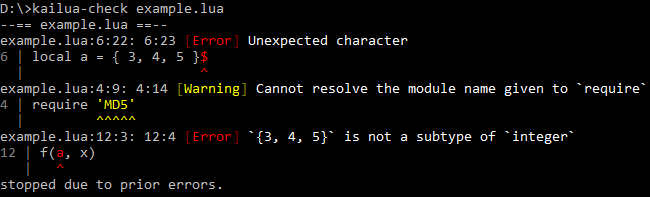

# 🌴 카일루아

[English](README.md)

**카일루아**는 [루아][Lua] 프로그래밍 언어를 위한 실험적 타입 검사기 및 통합 개발 환경(IDE)입니다.
(현재는 루아 5.1만 지원됩니다.)

## 설치와 사용

카일루아는 독립 검사기(`kailua-check`)로도 쓸 수 있고 IDE 플러그인으로도 쓸 수 있습니다.

### 독립 검사기

독립 검사기를 설치하려면 먼저 [러스트를 설치][install Rust]한 뒤(1.15 이상이 필요합니다),
이 저장소를 체크아웃하고 다음을 입력합니다.

```
cd kailua_check
cargo install
```

`kailua-check <검사를 시작할 파일 경로>`로 실행할 수 있습니다.



### Visual Studio Code

**주의: 현재 VS Code용 확장은 (배포의 문제로) 윈도에서만 동작합니다.**

카일루아는 [Visual Studio Code][VSCode]에서 IDE로 사용할 수 있습니다.
빠른 실행(`Ctrl-P`)에서 `ext install kailua`를 입력해서 설치합니다.

루아 코드를 포함하는 폴더를 열면 설정 파일을 찾을 수 없다는 오류가 나옵니다.
이 설정 파일은 실시간으로 검사를 수행하는 데 필요합니다.


`.vscode/kailua.json`을 직접 만들어도 되고,
명령 팔레트(`Ctrl-Shift-P`)에서 "Kailua"로 찾아 설정 파일을 수정할 수도 있습니다.


수동으로 편집할 경우 `.vscode/kailua.json`에 다음 내용이 필요합니다.

```json
{
    "start_path": "<검사를 시작할 파일 경로>"
}
```

설정 파일을 적용하려면 `Ctrl-R`로 현재 창을 새로 로드해야 합니다.

### 첫 카일루아 코드

시작점을 지정했으면 첫 카일루아 코드를 작성해 보죠.

```lua
--# open lua51
print('Hello, world!')
```

이 코드를 잠시 가지고 건드려 보면서 카일루아가 어떤 오류를 잡아 낼 수 있는지 확인해 보세요.

## 카일루아 언어

### 특별한 주석

카일루아는 올바른 루아 코드의 부분집합으로 별도의 변환 작업이나 컴파일이 필요 없습니다.
추가된 것들은 특별한 주석에 쓰여 있습니다.

* `--: <타입>`은 앞에 나오는 것의 타입(들)을 지정합니다.

  이 주석은 새 이름이 정의될 수 있는 모든 곳에서 쓰일 수 있습니다.
  여기에는 `local`(개별 이름 또는 문장 뒤), `function`(인자 뒤), `for`(개별 이름 뒤)
  및 대입문(개별 이름 또는 문장 뒤)이 포함됩니다.

  이름 뒤에 쓰일 경우에는, 타이핑의 편의를 위해
  다음과 같이 콤마나 닫는 괄호를 주석 *앞*으로 옮길 수 있습니다.

  ```lua
  function f(x, --: integer
             y, --: integer
             z) --: integer
      -- ...
  end
  ```

  여러 이름을 선언하는 흔한 경우에는 문장 뒤에 여러 타입을 지정할 수 있으며,
  이 경우 각 타입은 쉼표로 구분됩니다.

* `--> <타입>`은 함수의 반환 타입을 지정합니다.

  이 주석은 함수 인자를 닫는 괄호 뒤에서만 쓰일 수 있으며,
  마지막 인자에 대응하는 `--:`와 `--v`는 같은 줄에 쓰일 수 있습니다.

* `--v function(<이름>: <타입> ...) [--> <타입>]`은 함수 타입을 지정합니다.

  이 주석은 `function` 예약어 앞에 올 수 있습니다(네, 익명 함수에도 쓰일 수 있습니다).
  `--:`와 `-->`를 쓰는 것과 동일하나 훨씬 읽기 쉽습니다.

* `--# ...`은 타입 검사기에게 내리는 특별한 명령입니다.

  가장 중요한 명령으로는 `--# open <내장 라이브러리 이름>`이 있는데,
  이는 대응되는 내장된 이름들을 읽어 들이면서 앞으로 어떤 언어 변종을 쓸지를 결정합니다.
  현재 지원되는 유일한 내장 라이브러리는 `lua51`(무수정 루아 5.1) 뿐입니다.
  시작점이 되는 파일의 주석이 아닌 첫 줄에 이 명령을 두는 게 좋습니다.

  `--# type <이름> = <타입>`은 타입 별명을 짓는데 쓰입니다.
  타입 별명은 현재 영역에만 유효하며, `local`과 비슷하나 중복 이름을 허용하지 않습니다.

  `--# assume [global] <이름>: <타입>`은 주어진 이름의 타입을 *덮어 씌웁니다*.
  `global` 예약어가 있으면 전역 이름을 가리키고, 아니면 `local`처럼 새 지역 이름이 생깁니다.
  검사기를 통과할 수 없는 경우를 해소하는 데 쓸 수 있지만 매우 위험하므로,
  **본인 책임으로 쓰시길 바랍니다.**

  추후에 다른 명령들이 추가될 수 있습니다.

같은 종류의 특별한 주석들은 여러 줄로 나눠 쓸 수 있습니다.

```lua
--# type Date = {
--#     hour = integer;
--#     min = integer;
--#     sec = integer;
--# }
```

### 타입

다음 기본 타입들이 인식됩니다.

* `nil`, `boolean`, `number`, `string`, `function`, `userdata`, `thread`, `table`은
  모두 기본 루아 타입을 가리킵니다.

* `integer`는 `number`이면서 검사 시간에 정수라고 판단할 수 있는 부분집합입니다.
  (나중에 루아 5.3 이상 지원이 들어갈 경우 기본 타입으로도 쓰일 예정입니다.)

* `true`나 `false`, 정수, 그리고 문자열 리터럴은
  각각 `boolean`, `integer` 및 `string`의 서브타입입니다.

* 테이블 타입은 네 종류의 유용한 경우로 나뉩니다.

  중요한 사항으로, 앞의 두 경우는 자동으로 추론되지 않기 때문에
  `local tab = {} --: vector<integer>`처럼 명시적으로 타입을 지정해야 합니다.

  * `vector<T>`는 연속된 정수 키를 가지는 테이블 타입입니다.

  * `map<Key, Value>`는 같은 키 타입과 값 타입을 가지는 테이블 타입입니다.

  * `{ key = T, ... }`는 모든 키가 문자열이고 검사 시간에 알 수 있는 레코드입니다.
    쉼표 대신에 세미콜론을 쓸 수 있습니다.

  * `{ T, ... }`는 모든 키가 연속된 정수인 튜플입니다.
    이것만 빼면 레코드와 유사합니다.

* `function(Arg, ...)`나 `function(Arg, ...) --> Ret`는 함수 타입입니다.
  반환 타입 `Ret`은 여러 타입일 수 있으며,
  이 경우 괄호로 감싸야 합니다(`function(vector<T>, integer) --> (integer, string)`).

* `T | T | ...`는 합(union) 타입입니다.
  이 타입은 여러 리터럴 중 하나일 수 있는 타입에 유용합니다(예: `"read" | "write" | "execute"`).
  다른 종류의 합 타입도 가능하나, 카일루아에서 이들 타입의 검사는 거의 지원되지 않습니다.

* `any`에는 어떤 타입 정보도 없으며,
  유용하게 쓰려면 `--# assume` 명령이 필수적입니다.

* `WHATEVER`(대문자 주의)는 타입 검사기가 항상 허용하는 *구멍*입니다.
  `map<integer, WHATEVER>`와 `map<WHATEVER, string>`은 호환되지만,
  `map<integer, WHATEVER>`와 `map<string, string>`은 호환되지 않습니다.
  타입 검사의 기본을 뒤흔드는 타입으므로 **본인 책임으로 쓰시길 바랍니다.**

카일루아 타입은 기본적으로 *`nil` 검사를 하지 않습니다*.
즉, `integer`에 `nil`을 대입할 수 있는데 `integer` 두 개를 더하는 것도 가능하며,
따라서 올바른 카일루아 코드도 실행 시간에 오류가 날 수 있습니다.
이 결정은 원래 언어를 고치지 않으면서 실용적인 타입 검사기를 만드는 데 필요했습니다.

만약 명시적으로 쓰길 원한다면 다른 두 개의 `nil` 검사 모드를 쓸 수 있습니다.
이 타입들은 (바로는 아니지만) 서로 자유롭게 대입이 가능하므로,
기계가 읽을 수 있는 문서라고 생각하시길 바랍니다.

* `T?`는 `nil`을 대입할 수 있지만 자신이 `nil`을 가질 수 있다는 걸 알고 있는 타입입니다.
  따라서 `integer?` 두 개는 더할 수 없습니다.

* `T!`는 `nil`이 들어갈 수 없다는 걸 보장합니다.

당연한 이유로, 테이블의 값은 항상 `T` 또는 `T?`가 됩니다.

마지막으로, 이름이나 테이블 값에 해당하는 타입 앞에는 `const`가 붙을 수 있습니다.
`const` 타입의 내부는 변경할 수 없습니다(예: `map<integer, const vector<string>>`).
하지만 `const` 타입에 대입하는 건 가능합니다(아니면 쓸모가 없겠지요).

### 타입 검사기를 피하기

모든 곳에 타입을 다는 것이 실용적이진 않으므로,
카일루아는 지역적으로 타입 검사를 피하는 두 가지 방법을 제공합니다.

* `--v [no_check] function(...)`은 뒤따르는 함수의 타입 검사를 비활성화합니다.

  카일루아가 주어진 함수 타입을 *믿어야* 하므로, 해당 타입은 생략될 수 없습니다.

* 무슨 파일이 검사되는지를 `.kailua` 파일로 덮어 씌울 수 있습니다.

  `require()`가 검사 시간에 확인되는 문자열로 호출될 경우
  카일루아는 `package.path`와 `package.cpath`에 설정된 값을 사용합니다.
  `package.path`의 경우 파일 `F`를 읽기 전에 `F.kailua`를 먼저 읽어 봅니다.
  `package.cpath`의 경우 파일 `F`는 아마 실행 파일일테니 `F.kailua`만 읽습니다.
  (검색 경로에 `?`라고 써 놓은 게 아닌 이상
  이런 파일들에는 두 개의 확장자 `.lua.kailua`가 붙게 됩니다.)

  `.kailua` 파일에는 원래 대응되는 코드가 주어진 타입을 가지고 있다고 *가정*하기 위해
  `--# assume` 명령을 많이 쓰게 됩니다.

## 소스 구조

카일루아는 [러스트][Rust] 프로그램으로, 여러 [크레이트][crates-and-modules]로 나뉘어 있습니다.

* [`kailua_env`](kailua_env/): 위치(span) 정보, 소스 코드 관리, 영역 매핑.

* [`kailua_diag`](kailua_diag/): 기본적인 지역화와 보고 기능.

* [`kailua_test`](kailua_test/): `kailua_syntax`와 `kailua_check`에서 쓰이는 테스트 러너.
  이 크레이트들에서 `cargo test`는 통합 테스트를 포함합니다.

* [`kailua_syntax`](kailua_syntax/): 오류 복구를 지원하는 루아 렉서 및 파서.
  카일루아 확장도 물론 지원합니다.

* [`kailua_check`](kailua_check/): 카일루아의 주 타입 검사기.

* [`kailua_vs`](kailua_vs/): 동작은 하지만 더 이상 개발되지 않는 [Visual Studio][VS] IDE 확장.
  [C#](kailua_vs/Source/) 코드와 [Rust](kailua_vs/src/) 코드를 둘 다 포함합니다.

* [`kailua_vsc`](kailua_vsc/): 개발 중인 [Visual Studio Code][VSCode] IDE 확장.

  * [`kailua_langsvr`](kailua_langsvr/): [Visual Studio Code][VSCode]용 독립 언어 서버.

  * [`kailua_langsvr_protocol`](kailua_langsvr_protocol/):
    컴파일 시간을 줄이기 위해 분리한, 매크로를 많이 쓰는 `kailua_langsvr`의 일부분.

## 라이선스

<!-- -->

[Lua]: https://www.lua.org/
[Rust]: https://www.rust-lang.org/
[install Rust]: https://www.rust-lang.org/install.html
[crates-and-modules]: https://doc.rust-lang.org/book/crates-and-modules.html
[VS]: https://www.visualstudio.com/
[VSCode]: https://code.visualstudio.com/

