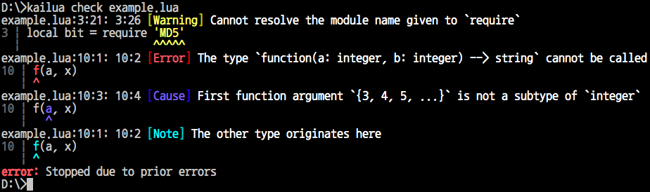
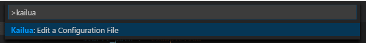

# 🌴 [카일루아][docs] [![(crates.io)][cratesio-image]][cratesio]

[docs]: https://devcat-studio.github.io/kailua/ko-KR/
[cratesio-image]: https://img.shields.io/crates/v/kailua.svg
[cratesio]: https://crates.io/crates/kailua

[English](README.md)

**카일루아**는 [루아][Lua] 프로그래밍 언어를 위한 실험적 타입 검사기 및 통합 개발 환경(IDE)입니다. (현재는 루아 5.1만 지원됩니다.)

**자세한 문서는 [여기][docs]에서 볼 수 있습니다.**

## 설치와 사용

카일루아는 독립 검사기로도 쓸 수 있고 IDE 플러그인으로도 쓸 수 있습니다.

### 독립 검사기

독립 검사기를 설치하려면 먼저 [러스트를 설치][install Rust]한 뒤(1.15 이상이 필요합니다), 다음을 입력합니다.

```
cargo install -f kailua
```

(`-f`는 이미 설치된 검사기도 함께 업그레이드 해 줍니다.)

`kailua check <검사를 시작할 파일 경로>`로 실행할 수 있습니다.



또한 `kailua.json`이나 `.vscode/kailua.json`이 해당 디렉토리에 있다면 `kailua check <검사할 디렉토리 경로>`로 실행할 수도 있습니다. 설정 파일의 포맷은 이 문서의 뒷부분을 참고하세요.

### Visual Studio Code

카일루아는 [Visual Studio Code][VSCode]에서 IDE로 사용할 수 있습니다. 빠른 실행(`Ctrl-P`)에서 `ext install kailua`를 입력해서 설치합니다. **윈도 이외의 환경에서는 앞에서 설명된 대로 독립 검사기를 먼저 설치해야 합니다.**

루아 코드를 포함하는 폴더를 열면 설정 파일을 찾을 수 없다는 오류가 나옵니다. 이 설정 파일은 실시간으로 검사를 수행하는 데 필요합니다.


`.vscode/kailua.json`을 직접 만들어도 되고, 명령 팔레트(`Ctrl-Shift-P`)에서 "Kailua"로 찾아 설정 파일을 수정할 수도 있습니다.



수동으로 편집할 경우 `.vscode/kailua.json`에 다음 내용이 필요합니다.

<!-- what Kailua really supports is not exactly JSON5, but probably it's closer than JSON. -->

```json5
{
    "start_path": "<검사를 시작할 파일 경로>",

    "preload": {
        // 아래는 우리가 루아 5.1와 모든 기본 라이브러리를 사용함을 나타냅니다.
        "open": ["lua51"],
    },
}
```

설정 파일을 적용하려면 `Ctrl-R`로 현재 창을 새로 로드해야 합니다.

### 첫 카일루아 코드

시작점을 지정했으면 첫 카일루아 코드를 작성해 보죠.

```lua
--# open lua51
print('Hello, world!')
```

설정 파일을 사용하고 있다면 좀 더 간단한 코드도 가능합니다.

```lua
print('Hello, world!')
```

이 코드를 잠시 가지고 건드려 보면서 카일루아가 어떤 오류를 잡아 낼 수 있는지 확인해 보세요.

## 라이선스

카일루아는 [MIT 라이선스][license-mit]와 [아파치 라이선스 2.0][license-apl]으로 라이선스되어 있으며 둘 중 하나를 선택할 수 있습니다. 카일루아에 기여하면 기여된 내용이 이 두 라이선스로 라이선스된다는 데 동의하게 됩니다.

<!-- -->

[Lua]: https://www.lua.org/
[Rust]: https://www.rust-lang.org/
[install Rust]: https://www.rust-lang.org/install.html
[VSCode]: https://code.visualstudio.com/
[internals-doc]: ./INTERNALS.md
[license-mit]: ./LICENSE-MIT
[license-apl]: ./LICENSE-APACHE

