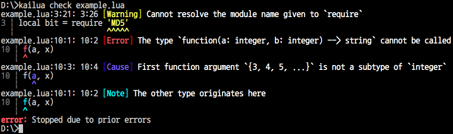
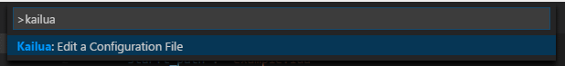

# 🌴 [Kailua][docs] [![(crates.io)][cratesio-image]][cratesio]

[docs]: https://devcat-studio.github.io/kailua/en-US/
[cratesio-image]: https://img.shields.io/crates/v/kailua.svg
[cratesio]: https://crates.io/crates/kailua

[한국어](README.ko.md)

**Kailua** is an experimental type checker and integrated development environment (IDE) for the [Lua] programming language (currently only Lua 5.1 is supported).

**The detailed documentation is available [here][docs].**

## Installation and Usage

Kailua can be used as a standalone checker or an IDE plugin.

### Standalone Checker

To install a standalone checker, [install Rust] first (1.15 or later required), then type the following:

```
cargo install -f kailua
```

(`-f` will cause the existing installation to be upgraded.)

You can run `kailua check <path to the entry point>` now.



You can also run `kailua check <path to the directory>`, if you have `kailua.json` or `.vscode/kailua.json` in that directory. The configuration format is described in the later section.

### Visual Studio Code

Kailua can be used as an IDE support for [Visual Studio Code][VSCode]. Install Kailua by typing `ext install kailua` from the Quick Launch (`Ctrl-P`). **If you are not on Windows, you should also install the standalone checker as above.**

You will see a warning that the configuration file is missing when you open a folder containing Lua codes. You need it for real-time checking.


You can either create `.vscode/kailua.json` by hand, or search "Kailua" from the Command Palette (`Ctrl-Shift-P`) to edit one.



The following content is required for `.vscode/kailua.json`, in case you are editing it by hand:

<!-- what Kailua really supports is not exactly JSON5, but probably it's closer than JSON. -->

```json5
{
    "start_path": "<path to the entry point>",

    "preload": {
        // This indicates that we are using Lua 5.1 and all built-in libraries of it.
        "open": ["lua51"],
    },
}
```

You need to reload the current window (`Ctrl-R` or `Cmd-R`) to apply the configuration.

### Your First Kailua Code

Once you've set the entry point, you can write your first Kailua code:

```lua
--# open lua51
print('Hello, world!')
```

If you are using the configuration file, the first code can be made much simpler:

```lua
print('Hello, world!')
```

Play a bit with this code to see which errors Kailua can detect.

## License

Kailua is dual-licensed under the [MIT license][license-mit] and [Apache license 2.0][license-apl] at your option. By contributing to Kailua you agree that your contributions will be licensed under these two licenses.

<!-- -->

[Lua]: https://www.lua.org/
[Rust]: https://www.rust-lang.org/
[install Rust]: https://www.rust-lang.org/install.html
[VSCode]: https://code.visualstudio.com/
[internals-doc]: ./INTERNALS.md
[license-mit]: ./LICENSE-MIT
[license-apl]: ./LICENSE-APACHE

