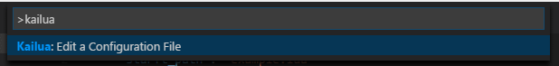

# 🌴 Kailua

**Kailua** is an experimental type checker and integrated development environment (IDE) for the [Lua] programming language (currently only Lua 5.1 is supported).

***THIS IS VERY EXPERIMENTAL PROJECT AND NO WARRANTY OR SUPPORT IS PROVIDED!***

## Installation and Usage

Kailua can be used as a standalone checker or an IDE plugin.

### Standalone Checker

To install a standalone checker, [install Rust] first (1.15 or later required), then type the following:

```
cargo install -f kailua
```

(`-f` will cause the existing installation to be upgraded.)

You can run `kailua check <path to the entry point>` now.


You can also run `kailua check <path to the directory>`, if you have `kailua.json` or `.vscode/kailua.json` in that directory. The configuration format is described in the later section.

### Visual Studio Code

Kailua can be used as an IDE support for [Visual Studio Code][VSCode]. Install Kailua by typing `ext install kailua` from the Quick Launch (`Ctrl-P`). **If you are not on Windows, you should also install the standalone checker as above.**

You will see a warning that the configuration file is missing when you open a folder containing Lua codes. You need it for real-time checking.


You can either create `.vscode/kailua.json` by hand, or search "Kailua" from the Command Palette (`Ctrl-Shift-P`) to edit one.



The following content is required for `.vscode/kailua.json`, in case you are editing it by hand:

<!-- what Kailua really supports is not exactly JSON5, but probably it's closer than JSON. -->

```json5
{
    "start_path": "<path to the entry point>",

    "preload": {
        // This indicates that we are using Lua 5.1 and all built-in libraries of it.
        "open": ["lua51"],
    },
}
```

You need to reload the current window (`Ctrl-R` or `Cmd-R`) to apply the configuration.

### Your First Kailua Code

Once you've set the entry point, you can write your first Kailua code:

```lua
--# open lua51
print('Hello, world!')
```

If you are using the configuration file, the first code can be made much simpler:

```lua
print('Hello, world!')
```

Play a bit with this code to see which errors Kailua can detect.

### Supported IDE Functions

* Real-time syntax checking (for all files).

* Real-time type checking, starting from given start path.

* Auto-completions for names and fields.

* Help for function signatures.

* Help for types of most subexpressions on hover.

* Go to definition for local and global names.

* Mass renaming of local and global names.

## Kailua the Language

### Special Comments

Kailua is a subset of valid Lua code---you don't need any transpilation or compilation. The additional annotations are described in special comments:

* `--: <type>` describes the type(s) of preceding item(s).

  It is valid anywhere a new name can be possibly defined: `local` (either individual names or statement), `function` (arguments), `for` (individual names) and assignment (either individual names or statement).

  When used right after the name, for the ease of typing, you can put a comma or closing parenthesis *before* the type like this:

  ```lua
  function f(x, --: integer
             y, --: integer
             z) --: integer
      -- ...
  end
  ```

  For the common case of defining multiple names you can put types after the statement. In this case types are delimited by commas.

* `--> <type>` describes the type(s) of function returns.

  It is valid only after the closing parenthesis of function arguments. It is valid to put `--:` (for the last argument) and `-->` in the same line.

* `--v function(<name>: <type> ...) [--> <type>]` describes a function type.

  It is valid before the `function` keyword (yes, also for anonymous functions). This is equivalent to `--:` and `-->`, but much more readable. All names should be identical to the corresponding declarations. Variadic arguments can be written as `...: <type>` at the end of arguments. Multiple returns need parentheses.

  The general rule of the thumb is that all functions have to be typed with either `--v` or `--:/-->` unless it is obvious from the preceding context. This allows you to write a code like `f(function(a, b) ... end)`, but only when `f` is known to accept such a function.

* `--v method(<name>: <type> ...) [--> <type>]` describes a method type.

  It is same to `function`, but for declarations like `function A:b(...)`. Kailua tries to infer the type of `self`, and if it's not possible you should use `function A.b(self, ...)` and `--v function(...)` instead for the clarity.

* `--# ...` is a special directive for the type checker.

  `--# open <built-in library name>` loads the corresponding built-in names and also implicitly specifies what language variant is currently in use. The only supported name so far is `lua51`, for the vanilla Lua 5.1. This is what `preload.open` configuration options actually do, and you should probably put it to the first non-comment line in the entry point if you don't have those options.

  `--# type [local | global] <name> = <type>` can be used to declare a type alias. There are three flavors of typa alises: `local` is locally scoped (much like `local` statements), `global` is globally scoped (much like `A = ...`), and no modifier indicates that the type is *exported* from the current file and they should be locally visible after `require`. Only local types can be in the inner scopes. Unlike variable names, inner type names should not overwrite outer names.

  `--# assume [global] <name>: <type>` *overrides* the type for given name. The `global` keyword forces the global assignment, otherwise a new scope is created like `local` statements. It is useful for sidestepping the checker issue, but it is also highly unsafe. **Use at your own risk.**

  More directives are likely to come.

The equal kind of special comments can span multiple lines.

```lua
--# type Date = {
--#     hour: integer;
--#     min: integer;
--#     sec: integer;
--# }
```

### Types

The following basic types are recognized:

* `nil`, `boolean` (or `bool`), `number`, `string`, `function`, `userdata`, `thread`, `table` for primitive Lua types.

* `integer` (or `int`) for a check-time integral subset of `number`. (In the future, in the Lua 5.3 mode or later, it will be also recognized as primitive.)

* `true` or `false`, integer and string literals are valid subtypes of `boolean`, `integer` and `string`, respectively.

* The table type is divided into four useful cases.

  Importantly, first two cases are not automatically inferred from the use and should be explicitly annotated like `local tab = {} --: vector<integer>`.

  * `vector<T>` for a table with consecutive integer keys.

  * `map<Key, Value>` for a homogeneous associative table.

  * `{ key1: T1, key2: T2 }` for records, whose keys are strings and fixed at the check time. You can use semicolons in place of commas.

    Explicitly declared records are "inextensible" by default, meaning that the list of fields is complete and cannot be altered. You can make it extensible by putting `...` at the end of fields; this allows a lazy initialization of records like `table.field = 'string'`. On the other hands, a normal Lua table is implicitly typed as extensible records, only made inextensible when required.

  * `{ T1, T2, T3 }` for tuples, whose keys are consecutive integers. Otherwise they are similar to records.

* `function(Arg, ...)` or `function(Arg, ...) --> Ret` for functions. `Ret` can be multiple types, in which case you need parentheses (`function(vector<T>, integer) --> (integer, string)`). Arguments can be named like `function(a: string, b: number)`.

* `T | T | ...` for union types. They are mostly useful for literal types (e.g. `"read" | "write" | "execute"`). Kailua has very limited support for checking other kinds of union types.

* `any` has no type information. `--# assume` is the only way to make it useful.

* `WHATEVER` (note the case) is a *hole* that the type checker always accepts. `map<integer, WHATEVER>` and `map<WHATEVER, string>` are compatible; `map<integer, WHATEVER>` and `map<string, string>` are not. As this thwarts the basic of type checking, **use at your own risk.**

The Kailua types are by default *not checked for `nil`*. That is, you can assign `nil` to `integer` but you can also add two `integer`s; the valid Kailua code can still result in a runtime error therefore. This restriction was required for making a practical type checker without changing the source programming language.

You can opt in two other `nil`-handling modes if you need to make it explicit. As they are (transitively) freely assignable, consider them more a machine-readable documentation.

* `T?` also accepts `nil` but it is aware that it can contain `nil`. Two `integer?`s cannot be added. It also allows for missing fields and missing arguments (they are not allowed otherwise): the type `{a: integer?, b: integer}` can contain either `{a = 42, b = 54}` or `{b = 54}`, but not `{a = 42}`.

* `T!` guarantees that it cannot contain `nil`.

Also, the table values are always `T` or `T?` (for the obvious reason).

Finally, types for the names and table values can optionally have a `const` prefix. You cannot modify the innard of `const` types: `map<integer, const vector<string>>`. You can still assign to them (otherwise this type won't be useful at all).

### Avoiding the type checker

As annotating everything is not practical, Kailua supports two ways to avoid the type checking with more localized guarantees:

* `--v [NO_CHECK] function(...)` disables the type checking for the following function.

  Kailua essentially *believes* the specified function type, which can be no longer omitted.

* You can override what file to check by having `.kailua` files.

  When `require()` was used with a check-time string Kailua makes use of `package.path` and `package.cpath` set. For `package.path`, it will try `F.kailua` first before reading a file `F`. For `package.cpath`, it will always `F.kailua` as `F` would be probably binary. (Note that this will normally result in two extensions `.lua.kailua` unless you have a sole `?` in the search paths.)

  `.kailua` files would frequently use `--# assume` as you should *assume* that the original code has given types.

## Configuration Format

You can configure the exact behavior of Kailua with `kailua.json`. It is a JSON with comments (`//`) and stray comma allowed for convenience:

```json5
{
    // This indicates where to start. This is the only mandatory field in the file.
    //
    // This can be a single string or an array of strings, and in the latter case
    // multiple paths are separately (but possibly parallelly) checked against.
    // Checking sessions do not affect others, but reports are merged.
    "start_path": ["entrypoint.lua", "lib/my_awesome_lib.lua"],

    // These are values for `package.path` and `package.cpath` variables, respectively.
    // They are always relative to the base directory
    // (a directory containing `.vscode` or `kailua.json` whichever being used).
    // Refer to the Lua manual for the exact format.
    //
    // In the configuration one can use a special `{start_dir}` sequence
    // which gets replaced by the directory containing the *current* start path.
    // so if there are two start paths `foo/a.lua` and `bar/b.lua`,
    // the path of `{start_dir}/?.lua` will expand to `foo/?.lua` or `bar/?.lua`
    // for each start path. This is useful when you are working with multiple projects
    // with individual directories, only sharing a portion of common codes.
    //
    // If they are not explicitly set, they are inferred from any assignments to
    // `package.path` and `package.cpath` variables. This can be handy for scripts,
    // but will be cumbersome for most other cases.
    //
    // It should be also noted that any path in `package_cpath` won't be directly
    // read by Kailua; only `.kailua` files associated to them will be read.
    "package_path": "?.lua;contrib/?.lua",
    "package_cpath": "native/?",

    // The preloading options to populate the environment before checking.
    // They are executed in the following order, and in each array, in given order.
    "preload": {
        // A list of `--# open` arguments.
        "open": ["lua51"],
        // A list of `require()` arguments. Affected by `package_*` options.
        "require": ["depA", "depB.core"],
    },
}
```

<!-- -->

[Lua]: https://www.lua.org/
[Rust]: https://www.rust-lang.org/
[install Rust]: https://www.rust-lang.org/install.html
[VSCode]: https://code.visualstudio.com/

